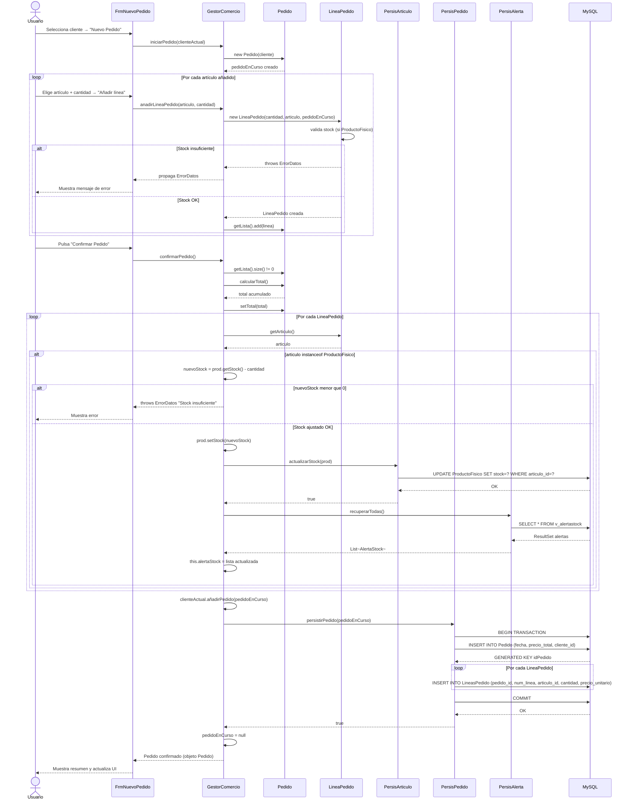

```mermaid
classDiagram
    direction TB

    class Identificable {
        <<interface>>
        +getId() int
        +setId(id: int)
    }
    class Vendible {
        <<interface>>
        +getNombre() String
        +precioUnitario() double
        +precioUnitarioFinal() double
    }
    class LogicaNegocio {
        <<interface>>
        +crearCliente(nombre, apellidos, telefono, email, nivelFidelidad) Cliente
        +listarClientes() List~Cliente~
        +crearProductoFisico(nombre, precioBase, iva, stock) ProductoFisico
        +crearServicio(nombre, precioBase, iva, minutos, urgente) Servicio
        +listarArticulos() List~Articulo~
        +iniciarPedido(cliente: Cliente)
        +anadirLineaPedido(articulo: Articulo, cantidad: int)
        +obtenerPedidoEnCurso() Pedido
        +confirmarPedido() Pedido
        +cancelarPedido()
        +listarPedidos() List~Pedido~
    }
    class InClient {
        <<interface>>
        +persistirCliente(c: Cliente) boolean
        +listarIDClientes() List~Integer~
        +recuperarCliennteByID(id: int) Cliente
        +recuperarTodos() List~Cliente~
    }
    class InArticulo {
        <<interface>>
        +persistirProducto(pf: ProductoFisico) boolean
        +persistirServicio(s: Servicio) boolean
        +actualizarStock(p: ProductoFisico) boolean
        +actualizarProducto(p: ProductoFisico) boolean
        +actualizarServicio(s: Servicio) boolean
        +recuperarTodo() List~Articulo~
    }
    class InPedido {
        <<interface>>
        +persistirPedido(p: Pedido) boolean
        +recuperarPedidos(cliente: Cliente, ar: List~Articulo~)
    }
    class InEmpleado {
        <<interface>>
        +persistirEmpleado(e: Empleado) boolean
        +recuperarTodos() List~Empleado~
        +modificarEmpleado(e: Empleado) boolean
        +eliminarEmpleado(id: int) boolean
    }
    class InAlerta {
        <<interface>>
        +persistirAlerta(a: AlertaStock) boolean
        +recuperarTodas() List~AlertaStock~
        +recuperarAlertaByID(id: int) AlertaStock
    }

    class EntidadBase {
        <<abstract>>
        -id: int
        +getId() int
        +setId(identificador: int)
    }
    class Persona {
        <<abstract>>
        -nombre: String
        -apellidos: String
        -telefono: String
        -puntero: int$
        +getNombre() String
        +getApellidos() String
        +getTelefono() String
        +getPuntero()$ int
        +setPuntero(p: int)$
    }
    class Cliente {
        -email: String
        -nivelFidelidad: int
        -listaPedidos: List~Pedido~
        +getEmail() String
        +getNivelFidelidad() int
        +añadirPedido(pedido: Pedido)
        +eliminarPedido(pedido: Pedido)
        +listarPedidos() List~Pedido~
        +numeroPedidos() int
        +buscarPedido(total: double) Pedido
    }
    class Empleado {
        -dni: String
        -nss: String
        -puesto: String
        -calle: String
        -ciudad: String
        -provincia: String
        -numero: String
        -cp: String
        -categoria: int
        -grupo: int
        -nivel: int
        -fechaContrato: LocalDate
        -antiguedadAnterior: double
        +getNombreCompleto() String
        +getDni() String
        +getNss() String
        +getFechaContrato() LocalDate
        +getTrienios() double
        +getPuesto() String
    }
    class Articulo {
        <<abstract>>
        -nombre: String
        -precioBase: double
        -iva: double
        -puntero: int$
        +getNombre() String
        +getPrecioBase() double
        +getIva() double
        +precioUnitario() double
        +precioUnitarioFinal() double
        +getPuntero()$ int
        +setPuntero(p: int)$
    }
    class ProductoFisico {
        -stock: int
        +getStock() int
        +setStock(stock: int)
        +restaUno()
        +precioUnitarioFinal() double
    }
    class Servicio {
        -minutos: int
        -urgente: boolean
        +getMinutos() int
        +isUrgente() boolean
        +precioUnitarioFinal() double
    }
    class Pedido {
        -fechaCreacion: LocalDateTime
        -total: double
        -lista: List~LineaPedido~
        -cliente: Cliente
        +añadirLinea(linea: LineaPedido)
        +eliminarLinea(linea: LineaPedido)
        +calcularTotal() double
        +getTotal() double
        +getLista() List~LineaPedido~
        +getCliente() Cliente
    }
    class LineaPedido {
        -cantidad: int
        -precioUnitarioFinal: double
        -articulo: Articulo
        -pedido: Pedido
        +getCantidad() int
        +getPrecioUnitarioFinal() double
        +getArticulo() Articulo
        +getPedido() Pedido
    }
    class AlertaStock {
        -id: int
        -nombreArticulo: String
        -stockActual: int
        -fechaAlerta: LocalDateTime
        +getId() int
        +getNombreArticulo() String
        +getStockActual() int
    }
    class Horas {
        -año: int
        -mes: int
        -cantidad: int
        +getCantidad() int
        +maxCantidad(cantidad: int)
    }
    class ErrorDatos {
        +ErrorDatos()
        +ErrorDatos(mensaje: String)
    }

    class GestorComercio {
        -INSTANCE: GestorComercio$
        -clientes: List~Cliente~
        -empleados: List~Empleado~
        -articulos: List~Articulo~
        -pedidos: List~Pedido~
        -alertaStock: List~AlertaStock~
        -clienteActual: Cliente
        -pedidoEnCurso: Pedido
        -pClient: PersisClient
        -pArticul: PersisArticulo
        -pPedido: PersisPedido
        -pAlerta: PersisAlerta
        -pEmpleado: PersisEmpleado
        +getInstance()$ GestorComercio
        +crearCliente(...) Cliente
        +crearEmpleado(...) Empleado
        +modificarEmpleado(emp: Empleado) boolean
        +borrarEmpleado(emp: Empleado) boolean
        +crearProductoFisico(...) ProductoFisico
        +crearServicio(...) Servicio
        +actualizarArticulo(articuloEditado: Articulo)
        +iniciarPedido(cliente: Cliente)
        +anadirLineaPedido(articulo: Articulo, cantidad: int)
        +confirmarPedido() Pedido
        +cancelarPedido()
        +listarClientes() List~Cliente~
        +listarArticulos() List~Articulo~
        +listarPedidos() List~Pedido~
        +buscarCliente(nombre, apellidos) Cliente
        +buscarClientes(nombre: String) List~Cliente~
        +buscarEmpleados(nombre: String) List~Empleado~
        +buscarArticulo(nombre: String) Articulo
        +selecionarArticulo(id: int) Articulo
        +selecionarCliente(lista, id) Cliente
        +actualizarAlerta()
        +estadoRojo() boolean
        +estadoAmbar() boolean
        +estadoVerde() boolean
    }

    class ConexionBase {
        <<abstract>>
        -URL: String$
        -USER: String$
        -PASS: String$
        #conexionDB() Connection
    }
    class PersisClient {
        +persistirCliente(c: Cliente) boolean
        +recuperarTodos() List~Cliente~
        +listarIDClientes() List~Integer~
        +recuperarCliennteByID(id: int) Cliente
    }
    class PersisArticulo {
        +persistirProducto(pf: ProductoFisico) boolean
        +persistirServicio(s: Servicio) boolean
        +actualizarStock(p: ProductoFisico) boolean
        +actualizarProducto(p: ProductoFisico) boolean
        +actualizarServicio(s: Servicio) boolean
        +recuperarTodo() List~Articulo~
    }
    class PersisPedido {
        +persistirPedido(p: Pedido) boolean
        +recuperarPedidos(cliente: Cliente, ar: List~Articulo~)
    }
    class PersisAlerta {
        +persistirAlerta(a: AlertaStock) boolean
        +recuperarTodas() List~AlertaStock~
        +recuperarAlertaByID(id: int) AlertaStock
    }
    class PersisEmpleado {
        +persistirEmpleado(e: Empleado) boolean
        +recuperarTodos() List~Empleado~
        +modificarEmpleado(e: Empleado) boolean
        +eliminarEmpleado(id: int) boolean
    }

    EntidadBase      ..|>  Identificable
    Persona          --|>  EntidadBase
    Cliente          --|>  Persona
    Empleado         --|>  Cliente
    Articulo         --|>  EntidadBase
    Articulo         ..|>  Vendible
    ProductoFisico   --|>  Articulo
    Servicio         --|>  Articulo
    ErrorDatos       --|>  Exception
    GestorComercio   ..|>  LogicaNegocio
    PersisClient     --|>  ConexionBase
    PersisClient     ..|>  InClient
    PersisArticulo   --|>  ConexionBase
    PersisArticulo   ..|>  InArticulo
    PersisPedido     --|>  ConexionBase
    PersisPedido     ..|>  InPedido
    PersisAlerta     --|>  ConexionBase
    PersisAlerta     ..|>  InAlerta
    PersisEmpleado   --|>  ConexionBase
    PersisEmpleado   ..|>  InEmpleado

    Cliente          "1" *-- "0..*"  Pedido        : listaPedidos
    Pedido           "1" *-- "1..*"  LineaPedido   : lista
    LineaPedido      "0..*" -->      Articulo      : articulo
    LineaPedido      "0..*" -->      Pedido        : pedido ref
    Pedido           "0..*" -->      Cliente       : cliente ref
    GestorComercio   "1" o-- "0..*"  Cliente       : clientes
    GestorComercio   "1" o-- "0..*"  Empleado      : empleados
    GestorComercio   "1" o-- "0..*"  Articulo      : articulos
    GestorComercio   "1" o-- "0..*"  AlertaStock   : alertaStock
    GestorComercio   "1" o-- "0..1"  Pedido        : pedidoEnCurso
    GestorComercio   "1" o-- "0..1"  Cliente       : clienteActual
    GestorComercio   --> PersisClient   : usa
    GestorComercio   --> PersisArticulo : usa
    GestorComercio   --> PersisPedido   : usa
    GestorComercio   --> PersisAlerta   : usa
    GestorComercio   --> PersisEmpleado : usa
```

```mermaid
sequenceDiagram
    actor       U   as Usuario
    participant F   as FrmNuevoPedido
    participant GC  as GestorComercio
    participant P   as Pedido
    participant LP  as LineaPedido
    participant PA  as PersisArticulo
    participant PP  as PersisPedido
    participant PAL as PersisAlerta
    participant DB  as MySQL

    U  ->> F  : Selecciona cliente → "Nuevo Pedido"
    F  ->> GC : iniciarPedido(clienteActual)
    GC ->> P  : new Pedido(cliente)
    P -->> GC : pedidoEnCurso creado

    loop Por cada artículo añadido
        U  ->> F  : Elige artículo + cantidad → "Añadir línea"
        F  ->> GC : anadirLineaPedido(articulo, cantidad)
        GC ->> LP : new LineaPedido(cantidad, articulo, pedidoEnCurso)
        LP ->> LP : valida stock (si ProductoFisico)
        alt Stock insuficiente
            LP -->> GC : throws ErrorDatos
            GC -->> F  : propaga ErrorDatos
            F  -->> U  : Muestra mensaje de error
        else Stock OK
            LP -->> GC : LineaPedido creada
            GC ->> P  : getLista().add(linea)
        end
    end

    U  ->> F  : Pulsa "Confirmar Pedido"
    F  ->> GC : confirmarPedido()
    GC ->> P  : getLista().size() != 0
    GC ->> P  : calcularTotal()
    P -->> GC : total acumulado
    GC ->> P  : setTotal(total)

    loop Por cada LineaPedido
        GC ->> LP : getArticulo()
        LP -->> GC : articulo
        alt articulo instanceof ProductoFisico
            GC ->> GC : nuevoStock = prod.getStock() - cantidad
            alt nuevoStock menor que 0
                GC -->> F  : throws ErrorDatos "Stock insuficiente"
                F  -->> U  : Muestra error
            else Stock ajustado OK
                GC ->> GC : prod.setStock(nuevoStock)
                GC ->> PA : actualizarStock(prod)
                PA ->> DB : UPDATE ProductoFisico SET stock=? WHERE articulo_id=?
                DB -->> PA : OK
                PA -->> GC : true
                GC ->> PAL : recuperarTodas()
                PAL ->> DB : SELECT * FROM v_alertastock
                DB -->> PAL : ResultSet alertas
                PAL -->> GC : List~AlertaStock~
                GC ->> GC : this.alertaStock = lista actualizada
            end
        end
    end

    GC ->> GC  : clienteActual.añadirPedido(pedidoEnCurso)
    GC ->> PP  : persistirPedido(pedidoEnCurso)
    PP ->> DB  : BEGIN TRANSACTION
    PP ->> DB  : INSERT INTO Pedido (fecha, precio_total, cliente_id)
    DB -->> PP : GENERATED KEY idPedido
    loop Por cada LineaPedido
        PP ->> DB : INSERT INTO LineasPedido (pedido_id, num_linea, articulo_id, cantidad, precio_unitario)
    end
    PP ->> DB  : COMMIT
    DB -->> PP : OK
    PP -->> GC : true

    GC ->> GC  : pedidoEnCurso = null
    GC -->> F  : Pedido confirmado (objeto Pedido)
    F  -->> U  : Muestra resumen y actualiza UI
```
